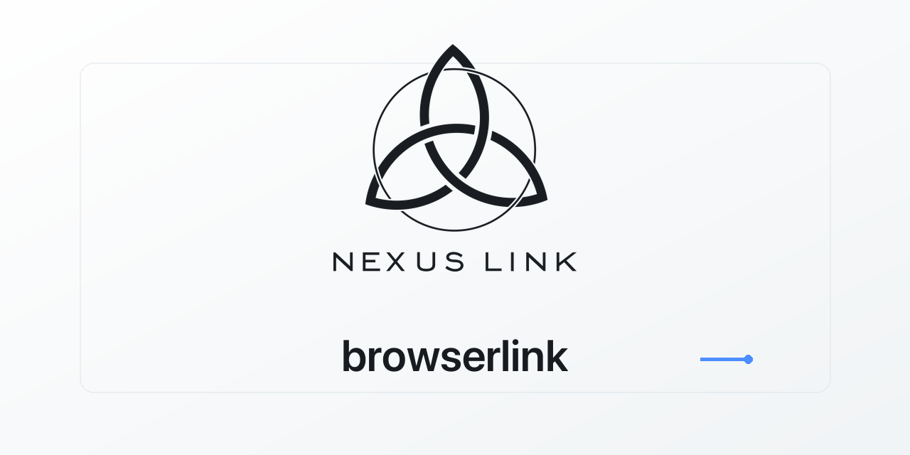

# Browserlink

**Annotate in your browser. Deliver to any AI harness.**

[](LICENSE)
[](CHANGELOG.md)
[](https://github.com/nexuslinkproductions/browserlink/actions)
[](server/hub.py)
[](docs/mcp.md)
[](extension/manifest.json)



browserlink is a harness-agnostic annotation link between your browser and
your AI coding tools. Draw on a page, pick elements DevTools-style, type your
instructions, then send the whole annotated context straight to the harness
you're working in. Your browser stays yours: logins, sessions, cookies,
untouched. Built for [Perplexity Comet](https://www.perplexity.ai/comet)
first, works in any Chromium browser (Chrome, Edge, Brave, Arc).

```
┌─────────────────────────┐   POST /annotations    ┌──────────────────────────┐
│  Your browser (Comet…)  │ ─────────────────────► │  browserlink hub (local) │
│  • draw annotations     │  schema v1 (docs)      │  REST inbox, CORS, safe  │
│  • element picker       │                        │  atomic writes           │
│  • instruction chat     │                        └────┬─────┬───────┬───────┘
└─────────────────────────┘                             │     │       │
                         ┌──────────────────────────────┘     │       └──────────────┐
                         ▼                                    ▼                      ▼
                  ┌──────────────┐                    ┌──────────────┐      ┌──────────────────┐
                  │  MCP server  │                    │  adapters    │      │   REST API       │
                  │  (stdio)     │                    │ hermes/webhook│     │   curl-friendly  │
                  └──────────────┘                    └──────────────┘      └──────────────────┘
                         │
          Claude Code · Hermes · Codex · Cursor · OpenCode · anything MCP
```

## Quickstart (3 steps)

```bash
# 1. Run the hub (localhost, port 8787)
python3 server/hub.py

# 2. Load the extension in your browser
#    chrome://extensions → Developer mode → Load unpacked → extension/
#    (Comet: same path; the extension works in any Chromium browser)

# 3. Connect a harness
#    Any MCP client:
pip install -e mcp/   # or: npx browserlink-mcp
#    then add to your harness's MCP config:
#    { "mcpServers": { "browserlink": { "command": "browserlink-mcp" } } }
```

Open any page → **Annotate** to draw, **Element** to pick elements (hover
highlight, click to select, type instructions in the chat card) → **Send**.
The annotation lands in the hub inbox (`~/.browserlink/annotations/`) and is
delivered to your connected harness.

## Invoke from any chat

From any MCP-capable harness chat you can point the extension at *this*
session without manually wiring chat to tool:

1. Install and run the hub (`python3 server/hub.py`).
2. Load the extension and leave it open in your browser.
3. Register the MCP server with your harness, then call:

```
browserlink_connect(sessionId="<this session id>", label="my chat", activate=true)
```

What happens next:

- MCP posts the session to `POST /target` and sets `activate` via `/activate`.
- The extension polls `GET /target` every 30s (`chrome.alarms`).
- On `activate: true` it injects the overlay into the active tab, then acks
  with `POST /activate {active:false}` so inject runs once per connect.
- Later annotations go to the hub; the Hermes adapter prefers
  `target.json` `sessionId` over `HERMES_SESSION_ID`.

Disconnect with `browserlink_disconnect()`. Check with `browserlink_status()`.
See [MCP tools](docs/mcp.md) for Claude Code and Hermes setup examples.

## TypeScript quickstart (v2)

The Node/TypeScript hub and MCP server ship as `browserlink-mcp` (Node 22+).
They speak the same REST contract and MCP tool names as the Python path.

```bash
# Hub (localhost, port 8787 by default)
npx browserlink-hub
# or: npm install -g browserlink-mcp && browserlink-hub

# MCP server (stdio) for any MCP client
npx browserlink-mcp
# or: npm install -g browserlink-mcp && browserlink-mcp
```

Example MCP client config:

```json
{ "mcpServers": { "browserlink": { "command": "npx", "args": ["browserlink-mcp"] } } }
```

Override the hub URL with `BROWSERLINK_HUB_URL` (default
`http://127.0.0.1:8787`). Data dir resolution matches Python:
`BROWSERLINK_DATA_DIR`, else `HERMES_HOME/annotations`, else
`~/.browserlink/annotations`.

## Features

- **Draw annotations** - circles, arrows, scribbles; normalized coordinates
  so annotations stay accurate across scroll and resize; undo/clear.
- **Element picker** - DevTools-style hover highlight with `tag#id.class`
  chips; click to select; numbered markers; real element descriptors
  (tag, id, classes, text, href, cssPath, rect).
- **Instruction chat** - a chat card per element: type your thoughts, edit on
  re-click, batch them all into one send.
- **Activation toggle** - a master switch in the popup (default ON, persisted
  per profile): deactivates the tool on the current page with one click, and
  re-activates it straight from the popup.
- **Collapsible, movable toolbar** - drag the toolbar anywhere on the page,
  collapse it to a small chip, or exit the tool entirely with the power or
  close button.
- **Element inspector with inline editing** - select an element in Element
  mode to see its current computed styles, type desired values inline, and
  ship them as structured `elements[].edits` in the annotation payload.
- **Interactive inspector** - sliders, font dropdown (local fonts), color
  pickers and selects that apply changes LIVE to the element; per-row Reset
  and Reset All; hovering a property row highlights what it affects on the
  page.
- **Lightweight text editor** - multiline text editing with formatting
  controls (bold, italic, underline, alignment, text transform) that write
  live styles and ship as structured `edits` (`textAlign`, `textTransform`,
  `letterSpacing`, `wordSpacing`, `whiteSpace`, `verticalAlign`,
  `textDecoration`, `fontStyle`, `textShadow`, plus existing font/color keys).
- **Multi-select** - Shift+click to select several elements at once; each
  keeps its own instruction and edits; Send ships them all in one payload.
- **Element-crop screenshots** - sending captures the visible tab and crops
  it to the selected elements, so the chat receives a screenshot of exactly
  what you annotated (plus the annotation file as an attachment).
- **Collapsible inspector categories** - inspector rows group under
  Text / Layout / Appearance / Other headers; click a header to collapse or
  expand the group; collapse state persists per tab.
- **Element-mode hover boxes** - hovering in Element mode draws a clear
  outline box around the element under the cursor (tracks scroll and resize),
  so you can see exactly what you are about to select.
- **Harness-neutral** - MCP server (works with every major harness), REST API,
  and pluggable adapters (Hermes chat injection, generic webhooks).
- **Your sessions stay yours** - the extension never touches page DOM beyond a
  closed ShadowRoot; the hub is localhost-only; annotations are JSON files
  with no tracking.

## Docs

- [Protocol (schema v1)](docs/protocol.md) - the public annotation contract
- [MCP tools](docs/mcp.md)
- [REST API](docs/rest.md)
- [Harness guides](docs/harnesses.md)
- [Security model](docs/security.md)

## Development

```bash
python3 -m py_compile server/hub.py mcp/mcp_server.py
pytest -q
node --check extension/content.js extension/service-worker.js extension/popup.js
```

## License

MIT - see [LICENSE](LICENSE).
