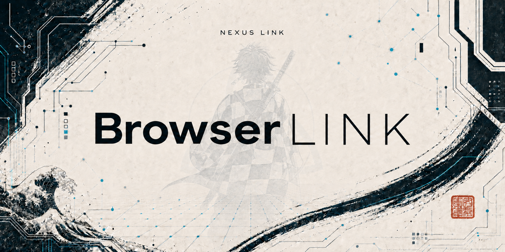
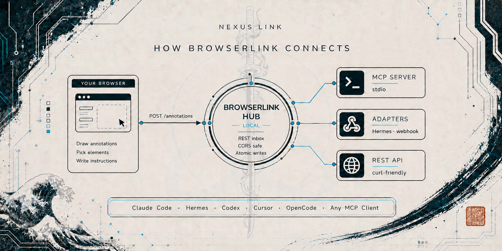
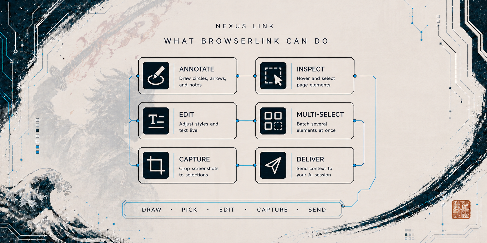

# Browserlink

**Annotate in your browser. Deliver to any AI harness.**

[](LICENSE)
[](CHANGELOG.md)
[](https://github.com/nexuslinkproductions/browserlink/actions)
[](docs/mcp.md)
[](extension/manifest.json)



browserlink is a browser annotation bridge designed specifically for Hermes
(and usable with any MCP-capable harness). Draw on a page, pick elements
DevTools-style, type your instructions, then send the whole annotated context
straight to the harness you're working in. Your browser stays yours: logins,
sessions, cookies, untouched. The TypeScript hub (`npx browserlink-hub`) is
the implementation. Built for [Perplexity Comet](https://www.perplexity.ai/comet)
first, works in any Chromium browser (Chrome, Edge, Brave, Arc).



## Quickstart (3 steps)

```bash
# 1. Run the hub (localhost, port 8787)
#    from this repo:  cd ts && npm ci && npm run build && node dist/cli-hub.js
#    or install globally:  npm install -g . && browserlink-hub

# 2. Load the extension in your browser
#    chrome://extensions → Developer mode → Load unpacked → extension/
#    (Comet: same path; the extension works in any Chromium browser)

# 3. Connect a harness
#    Any MCP client:
#    from this repo:  cd ts && npm ci && npm run build && node dist/cli-mcp.js
#    or install globally:  npm install -g . && browserlink-mcp
#    then add to your harness's MCP config:
#    { "mcpServers": { "browserlink": { "command": "browserlink-mcp" } } }
```

Open any page → **Annotate** to draw, **Element** to pick elements (hover
highlight, click to select, type instructions in the chat card) → **Send**.
The annotation lands in the hub inbox (`~/.browserlink/annotations/`) and is
delivered to your connected harness.

### First run

- **Three-step intro** - the first time the tool activates you see three
  coach marks in order: pick an element, add an instruction, then send.
  Each mark points at the real control; advance with Next/Enter, dismiss
  with Skip/Escape. Completing or skipping stores a one-time local flag, so
  the intro never replays after a refresh, extension reload, or browser
  restart. The popup's **Replay intro** button resets it explicitly.
- **Activation is per page by default** - a newly loaded page stays
  inactive until you turn the tool on for it. The popup's **Always on for
  this browser session** toggle switches to automatic activation on newly
  loaded eligible pages for the rest of the session only (cleared at
  browser restart, off by default, per-page exit still respected, and never
  applied to browser-internal pages).
- **Honest availability** - on pages where Chrome blocks extensions
  (chrome://, the web store, and similar), the popup states that the tool
  is unavailable instead of retrying or prompting. No account, no cloud:
  everything stays on your machine.

## Invoke from any chat

From any MCP-capable harness chat you can point the extension at *this*
session without manually wiring chat to tool:

1. Install and run the hub (from this repo: `cd ts && npm ci && npm run build && node dist/cli-hub.js`).
2. Load the extension and leave it open in your browser.
3. Register the MCP server with your harness, then call:

```
browserlink_connect(sessionId="<this session id>", label="my chat", activate=true)
```

What happens next:

- MCP posts the session to `POST /target` and sets `activate` via `/activate`.
- The extension polls `GET /target` every 30s (`chrome.alarms`).
- On `activate: true` it injects the overlay into the active tab, then acks
  with `POST /activate {active:false}` so inject runs once per connect.
- Later annotations go to the hub; the Hermes adapter prefers
  `target.json` `sessionId` over `HERMES_SESSION_ID`.

Disconnect with `browserlink_disconnect()`. Check with `browserlink_status()`.
See [MCP tools](docs/mcp.md) for Claude Code and Hermes setup examples.

## TypeScript quickstart (v2)

The Node/TypeScript hub and MCP server live in `ts/` (Node 22+).
They speak the same REST contract and MCP tool names as prior releases.

```bash
# Build once (from the repo root)
cd ts && npm ci && npm run build

# Hub (localhost, port 8787 by default)
node dist/cli-hub.js
# or, installed globally: browserlink-hub

# MCP server (stdio) for any MCP client
node dist/cli-mcp.js
# or, installed globally: browserlink-mcp
```

Example MCP client config:

```json
{ "mcpServers": { "browserlink": { "command": "browserlink-mcp" } } }
```

Override the hub URL with `BROWSERLINK_HUB_URL` (default
`http://127.0.0.1:8787`). Data dir resolution:
`BROWSERLINK_DATA_DIR`, else `HERMES_HOME/annotations`, else
`~/.browserlink/annotations`.

## Features



### Annotate

- **Draw annotations** - circles, arrows, scribbles; normalized coordinates
  stay accurate across scroll and resize; undo/clear.
- **Element picker** - DevTools-style hover highlight with `tag#id.class`
  chips; click to select; numbered markers; real element descriptors
  (tag, id, classes, text, href, cssPath, rect).
- **Deep picker (shadow DOM + iframes)** - reaches elements inside open
  shadow roots and same-origin iframes, including nested frames.
  Cross-origin frames degrade explicitly to an honest bounded target.
- **Multi-select** - Shift+click to select several elements at once; each
  keeps its own instruction and edits; Send ships them all in one payload.
- **Text-selection quick actions** - select any text to get Note, Ask AI,
  and Highlight actions, all quote-linked via the `textQuote` descriptor.
- **Element-crop screenshots** - sending captures the visible tab and crops
  it to the selected elements, so the chat receives a screenshot of exactly
  what you annotated.

### Instruct

- **Instruction chat** - a chat card per element: type your thoughts, edit on
  re-click, batch them all into one send.
- **Intent and Priority** - optional per-element chips (fix/change/question/
  approve and blocking/important/suggestion) shipped inside each element and
  printed as labels in the harness message.
- **Element threads** - committed instructions form an ordered, append-only
  reply thread (`threadId`/`parentId`), surviving refresh and replayable via
  `GET /annotations/<name>/thread`.
- **Element inspector with inline editing** - see computed styles, type
  desired values inline, and ship them as structured `elements[].edits`.
- **Interactive inspector** - sliders, font dropdown, color pickers and
  selects that apply changes LIVE; per-row Reset and Reset All.
- **Lightweight text editor** - multiline text editing with formatting
  controls (bold, italic, underline, alignment, text transform) that write
  live styles and ship as structured `edits`.
- **Annotation note queue** - Enter queues notes with a live counter in the
  toolbar; Send ships the whole batch (elements + notes) in one payload.

### Capture precisely

- **Freeze State Capture** - one-click Freeze pauses CSS animations and
  transitions for a clean, stable crop; annotations carry structured
  `captureState` metadata (frozen flag plus last hovered, focused, and open
  details selectors). The injected freeze style is always removed on exit.
- **Persistent Drafts** - unsent strokes, queued notes, and element
  instructions survive a refresh, stored locally per canonical URL. No
  account, no cloud sync; a draft clears only after a confirmed Send or
  Clear All.
- **Anchor resilience** - when an exact cssPath no longer resolves (DOM
  drift, SPA route change), draft replay re-anchors deterministically:
  exact path, then stable attributes, then text/aria label, then prior
  rectangle proximity. Ambiguous targets stay unresolved - never attached
  to the wrong element, never dropped.
- **Removal-aware anchoring** - anchors survive element removal via a bounded
  MutationObserver, falling back to the nearest surviving ancestor or
  persisting as detached draft ghost markers until remount.
- **Agent-ready context** - every annotation carries a schema v1.9
  environment snapshot (capturedAt, url, viewport, userAgent, language,
  devicePixelRatio, timezoneOffset) plus optional `textQuote` and thread
  fields, rendered in the AI brief with explicit `(omitted)` states.

### Deliver

- **Direct chat attachment delivery** - a sent annotation lands in the
  selected chat's composer as real attachment chips (screenshot + JSON),
  exactly like drag-and-drop; a message fallback ensures delivery never
  blocks.
- **Chat selector drives delivery** - pick the target session in the popup;
  the hub routes annotations to that chat.
- **Copy AI Brief** - one click copies the newest annotation as an AI-ready
  Markdown brief (page, per-element cssPaths, instructions, edits,
  Intent/Priority, capture state, notes, stroke summary, `@file`/`@image`
  references).
- **Share link (read-only page)** - one click copies a local share URL
  rendering a readable, read-only HTML page of the annotation. Local-only
  by default (hub binds 127.0.0.1); never a public link, no account needed.
- **Local save and backup** - save the newest capture as PNG or JPEG,
  download a deterministic ZIP bundle of annotation + brief + PNG
  (`/annotations/<name>/bundle`), or a full-corpus snapshot
  (`/annotations/backup.zip`). Nothing is uploaded anywhere.
- **Annotation recall** - local full-text search across all stored
  annotations (`GET /annotations?q=`), mirrored in the MCP
  `annotations_list` tool and the popup search box.
- **Webhook handoff** - optional `BROWSERLINK_WEBHOOK_URL` emits one bounded
  `annotation.thread.v1` JSON event per annotation; a webhook failure never
  blocks local storage or other adapters.
- **Programmatic control** - MCP `annotations_list` filters (q, url, since,
  cssPathPrefix, hasEdits, intent, severity, limit) and per-route opt-out
  for exact-origin or pathname-prefix pages.

### Feel at home

- **Activation toggle** - master switch in the popup (default ON, persisted
  per profile); also injects on demand into the active tab without a refresh.
- **First-run intro** - three coach marks (pick an element, add an
  instruction, send), one-time local flag, replayable from the popup.
- **Collapsible, movable toolbar** - drag anywhere, collapse to a small
  chip, or exit entirely with the power or close button.
- **Edge docking with animated morph** - drag to a screen edge to dock
  (vertical bar left/right, horizontal bar bottom) with a GSAP-animated
  transition.
- **Element-mode hover boxes** - a clear outline around the element under
  the cursor (tracks scroll and resize).
- **Collapsible inspector categories** - rows group under
  Text / Layout / Appearance / Other headers; collapse state persists.
- **Diagnostics** - `Ctrl+Shift+D` opens a live overlay (state, event ring
  buffer, health codes D-1..D-6); the same data is on
  `window.__browserlinkDiag`.
- **Harness-neutral** - MCP server (works with every major harness), REST
  API, and pluggable adapters (Hermes chat injection, generic webhooks).
- **Your sessions stay yours** - the extension never touches page DOM
  beyond a closed ShadowRoot; the hub is localhost-only; annotations are
  JSON files with no tracking.

## Docs

- [Protocol (schema v1)](docs/protocol.md) - the public annotation contract
- [MCP tools](docs/mcp.md)
- [REST API](docs/rest.md)
- [Harness guides](docs/harnesses.md)
- [Security model](docs/security.md)

## Development

```bash
node --check extension/content.js extension/service-worker.js extension/popup.js
cd ts && npm ci && npm test
```

## License

MIT - see [LICENSE](LICENSE).
